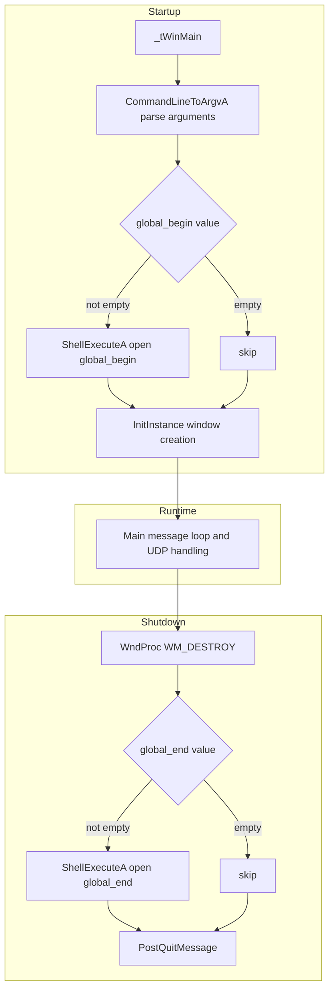
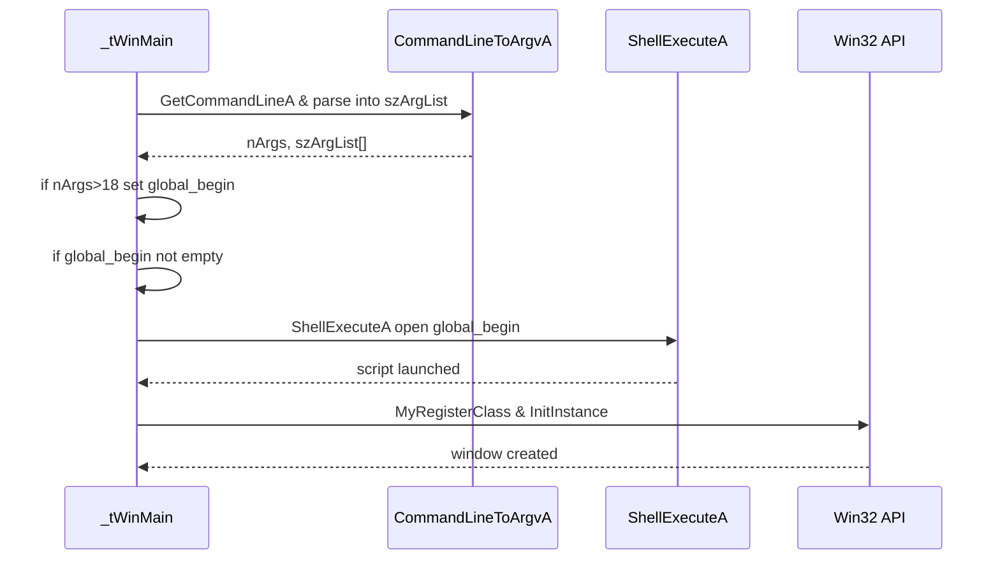
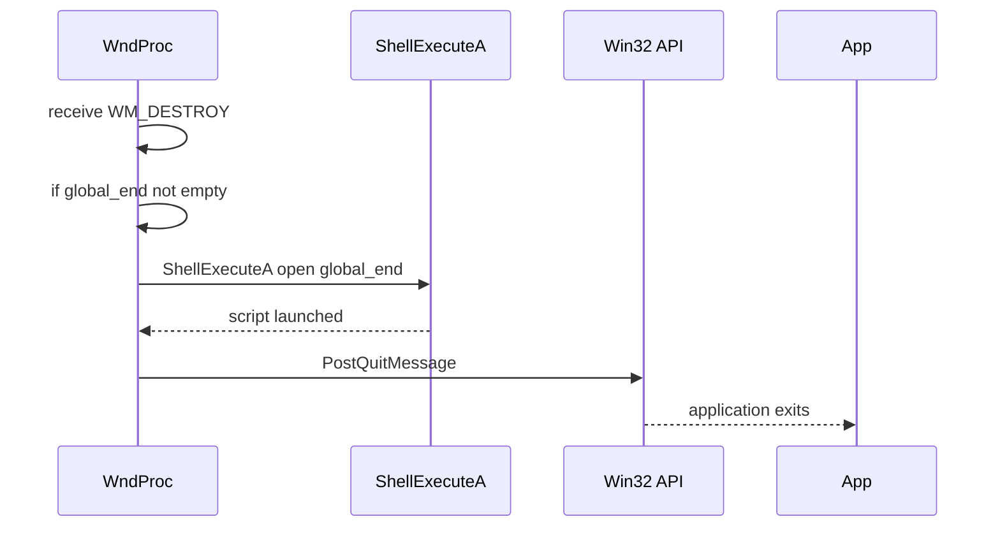

# Automation & XAOS Command Triggering – Begin/End Script Hooks Feature Documentation

## Overview

The **Begin/End Script Hooks** feature allows users to specify custom automation scripts that execute automatically when *spisocketswin32* starts and when it shuts down. By default, the application looks for `begin.ahk` at startup and `end.ahk` on exit, enabling users to initialize external environments, launch auxiliary tools, or perform cleanup tasks without manual intervention. For advanced scenarios, these defaults can be overridden via command-line arguments 18 (`global_begin`) and 19 (`global_end`), giving full control over the automation lifecycle.

This mechanism integrates seamlessly into the Win32 application bootstrap and teardown phases, leveraging `ShellExecuteA` to launch arbitrary scripts or executables. It ensures that startup automation occurs before window creation and message pumping begin, while shutdown hooks run just before the application posts its quit message.

## Architecture Overview



## Component Structure

### global_begin / global_end Defaults

**Location:** `spisocketswin32.cpp`

- Declared as globals with default values:

```cpp
  string global_begin = "begin.ahk";
  string global_end   = "end.ahk";
```

### Command-Line Argument Parsing

**Location:** Inside `_tWinMain` in `spisocketswin32.cpp`

- The code calls `CommandLineToArgvA(GetCommandLineA(), &nArgs)` to split the command line into `szArgList`.
- After handling core parameters, it checks for arguments at positions 18 and 19:

```cpp
  if (nArgs > 18) { global_begin = szArgList[18]; }
  if (nArgs > 19) { global_end   = szArgList[19]; }
```

### Startup Script Execution

**Location:** Immediately after argument parsing in `_tWinMain`

- If `global_begin` is non-empty, the application invokes:

```cpp
  ShellExecuteA(NULL, "open", global_begin.c_str(), "", NULL, nCmdShow);
```

- This call uses the Windows Shell API to launch the specified script or executable before window registration and creation complete.
- Requires `<shellapi.h>`

### Shutdown Script Execution

**Location:** In `WndProc` under `WM_DESTROY` case in `spisocketswin32.cpp`

- Just before posting the quit message, the code performs:

```cpp
  if (!global_end.empty())
      ShellExecuteA(NULL, "open", global_end.c_str(), "", NULL, 0);
  PostQuitMessage(0);
```

- Ensures cleanup or final automation runs before the process exits.

## Feature Flows

### 1. Startup Automation Flow



### 2. Shutdown Automation Flow



## Dependencies

- **Windows Shell API** (`ShellExecuteA`)

Used to launch external scripts. Requires `#include <shellapi.h>` .

- **Win32 Message Loop**

Hooks into `_tWinMain` startup and `WM_DESTROY` shutdown in `WndProc`.

## Key Classes Reference

| Class/Function | Location | Responsibility |
| --- | --- | --- |
| `_tWinMain` | `spisocketswin32.cpp` | Entry point; parses arguments; invokes startup hook. |
| `CommandLineToArgvA` | `spisocketswin32.cpp` | Splits raw command line into `argv` array. |
| `ShellExecuteA` | Windows Shell API | Launches begin/end scripts. |
| `WndProc` (WM_DESTROY) | `spisocketswin32.cpp` | Catches shutdown; invokes end hook then quits. |
