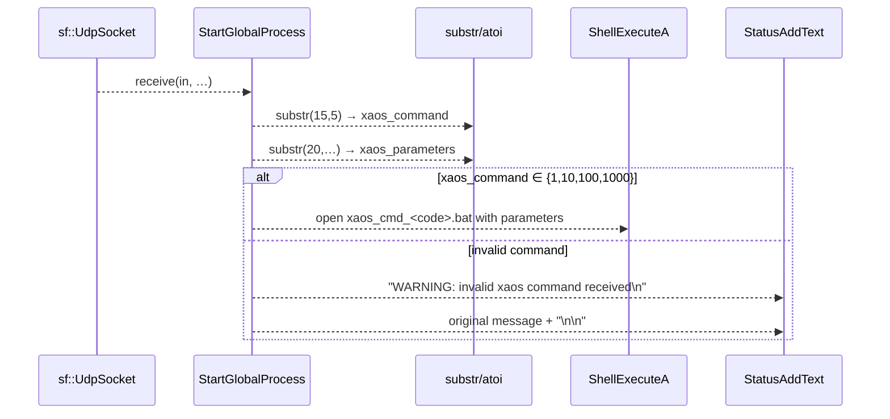

# Automation & XAOS Command Triggering

## Overview

In server mode, the application listens on UDP port 50001 and displays each incoming message in the transparent layered window. When a message follows the XAOS command format, the server parses out a numeric command code and any trailing parameters, then dispatches automation by launching a corresponding batch script (`xaos_cmd_<code>.bat`) with the parsed parameters. Invalid command codes are logged as warnings in the UI.

## XAOS Command Message Format

– Messages shorter than 20 characters are treated as plain text and are **not** dispatched.

– If `global_line.length() >= 20`, then:

• **Command code** is extracted as a decimal number from characters at offsets **15** through **19** (5 characters total).

• **Parameters** are taken from the substring starting at offset **20** to the end of the message.

For a message string `M` with zero-based indexing:

```cpp
if (M.length() >= 20) {
    xaos_command    = atoi(  M.substr(15, 5).c_str()  );
    xaos_parameters =       M.substr(20, M.length() - 20);
}
```

## Supported XAOS Commands

| Command Code | Batch Script |
| --- | --- |
| 1 | xaos_cmd_1.bat |
| 10 | xaos_cmd_10.bat |
| 100 | xaos_cmd_100.bat |
| 1000 | xaos_cmd_1000.bat |


## Dispatch Logic

Once `xaos_command` and `xaos_parameters` are extracted, `StartGlobalProcess` uses a series of conditional checks to decide which batch script to run. On a match, it calls `ShellExecuteA` with the `"open"` verb:

```cpp
int nShowCmd = FALSE;
if (xaos_command == 1) {
    ShellExecuteA(NULL, "open", "xaos_cmd_1.bat",    xaos_parameters.c_str(), NULL, nShowCmd);
}
else if (xaos_command == 10) {
    ShellExecuteA(NULL, "open", "xaos_cmd_10.bat",   xaos_parameters.c_str(), NULL, nShowCmd);
}
else if (xaos_command == 100) {
    ShellExecuteA(NULL, "open", "xaos_cmd_100.bat",  xaos_parameters.c_str(), NULL, nShowCmd);
}
else if (xaos_command == 1000) {
    ShellExecuteA(NULL, "open", "xaos_cmd_1000.bat", xaos_parameters.c_str(), NULL, nShowCmd);
}
else {
    StatusAddText("WARNING: invalid xaos command received\n");
    StatusAddText(global_line.c_str());
    StatusAddText("\n\n");
}
```

### Valid Command Flow

- `ShellExecuteA` is invoked with:
- `hwnd` = `NULL`
- `verb` = `"open"`
- `file` = `"xaos_cmd_<code>.bat"`
- `parameters` = the parsed `xaos_parameters` string
- `directory` = `NULL`
- `nShowCmd` = `FALSE` (batch window hidden)

### Invalid Command Handling

If `xaos_command` does not equal any supported code, the application:

1. Appends `"WARNING: invalid xaos command received\n"` to the static text.
2. Appends the original message (`global_line`) and two newlines.

All UI updates use the helper `StatusAddText()`.

## Sequence Diagram



## Reference

The entire XAOS dispatch block resides in the `StartGlobalProcess` timer callback within **spisocketswin32.cpp**, immediately after receiving and displaying the UDP message .