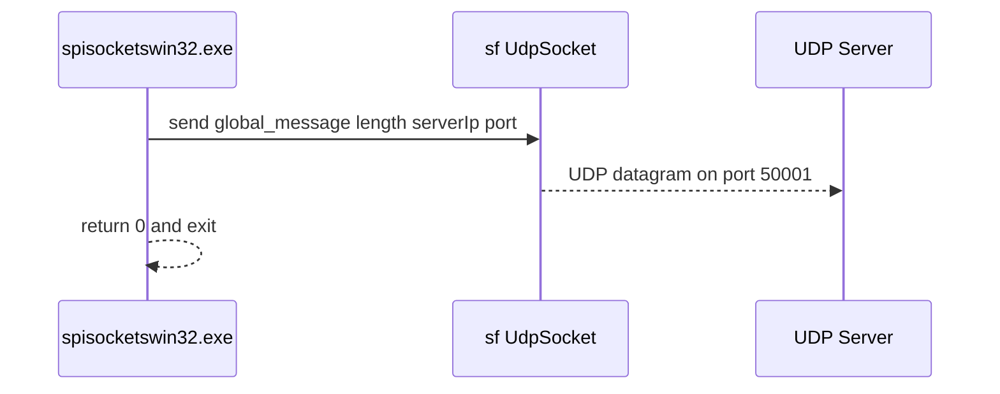

# Getting Started: Running spisocketswin32 (Server & Client) – UDP Client Mode (send one message then exit)

## Overview

Running **spisocketswin32** in client mode allows you to send a single UDP datagram to a server and then immediately exit. This is useful for scripting or automation scenarios where you simply need to dispatch a command or payload to a remote listener on port 50001 without maintaining a persistent connection.

## Prerequisites

- A Windows system with the built executable `spisocketswin32.exe` (built with MSVC 2017 / v141).
- The SFML Network library available at runtime (linked against `sfml-network.lib` and `sfml-system.lib`).
- The target UDP server must be listening on port 50001.

## Command-Line Invocation

To run as a UDP client, invoke:

```plaintext
spisocketswin32.exe client <destination IPv4> <message>
```

- **client**

Literal keyword to select client mode.

- **\<destination IPv4\>**

IPv4 address of the server to send to (e.g., 192.168.1.100).

- **\<message\>**

Payload string to send.

Example:

```plaintext
spisocketswin32.exe client 192.168.1.100 "Hello from client"
```

## How It Works

### Argument Parsing

In `_tWinMain`, the first three command-line arguments are assigned to global variables:

- `global_servername`
- `global_ipaddress`
- `global_message`

```cpp
if (nArgs > 1)
    global_servername = szArgList[1];    // "server" or "client"
if (nArgs > 2)
    global_ipaddress = szArgList[2];     // destination IPv4
if (nArgs > 3)
    global_message   = szArgList[3];     // payload string
```

### UDP Client Execution

When `global_servername` equals `"client"` (case-insensitive), the application:

1. Constructs an `sf::IpAddress` from `global_ipaddress`.
2. Creates an `sf::UdpSocket`.
3. Sends the contents of `global_message` to the specified address on port 50001.
4. Returns immediately with exit code 0 on success (or FALSE on failure).

```cpp
if (global_servername == "client" ||
    global_servername == "CLIENT" ||
    global_servername == "Client")
{
    sf::IpAddress server(global_ipaddress);
    sf::UdpSocket socket;

    if (socket.send(
            global_message.c_str(),
            global_message.length(),
            server,
            port) != sf::Socket::Done)
        return FALSE;

    return 0;  // exit immediately after sending
}
```

The constant `port` is defined as:

```cpp
const unsigned short port = 50001;
```

### Sequence Diagram



## Example

Send the text `"Status OK"` to a server at `10.0.0.5`:

```bat
C:\> spisocketswin32.exe client 10.0.0.5 "Status OK"
```

No output is shown on the console; the process exits immediately after dispatch.

## Dependencies

- SFML Network (`sfml-network.lib`, `sfml-system.lib`)
- WinMM (`winmm.lib`)
- PortAudio, FreeImage, and `spiwavsetlib` (for the overall application, though not used in client mode)

## Key Code References

| Symbol | File | Responsibility |
| --- | --- | --- |
| `_tWinMain` | spisocketswin32.cpp | Entry point; parses args and dispatches client or server mode |
| `global_servername` | spisocketswin32.cpp | Mode selector (`"client"` or `"server"`) |
| `global_ipaddress` | spisocketswin32.cpp | Destination IPv4 in client mode |
| `global_message` | spisocketswin32.cpp | Payload string in client mode |
| `sf::UdpSocket::send` call | spisocketswin32.cpp | Sends UDP datagram to server on port 50001 |
| `const unsigned short port` | spisocketswin32.cpp | Fixed port number (50001) |
