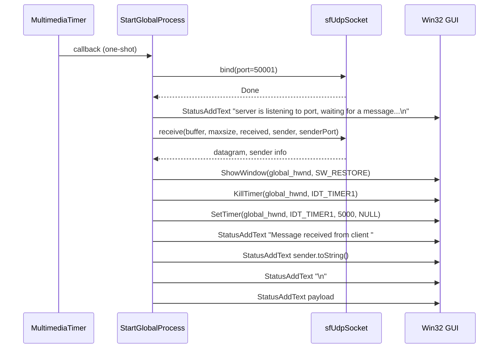

# Getting Started: Running spisocketswin32 in UDP Server Mode

## Overview

Running **spisocketswin32** in server mode turns the application into a UDP socket listener on port 50001.  Incoming datagrams are displayed in a transparent, layered Win32 window and trigger automation scripts based on parsed commands.  This mode is ideal for integrating simple UDP-based message dispatch into Windows automation workflows.

## Prerequisites

- A Windows system with the Visual C++ 2017 runtime installed.
- SFML (Network, System), FreeImage, PortAudio, winmm, and the local `spiwavsetlib` libraries linked into the build.

## Starting the Server

1. Open a Command Prompt and navigate to the folder containing `spisocketswin32.exe`.
2. Launch the application without arguments or with the first argument set to `"server"`:

```shell
   spisocketswin32.exe
```

or

```shell
   spisocketswin32.exe server
```

By default, `global_servername` is initialized to `"server"`, so omitting the argument has the same effect  .

1. The server binds to UDP port **50001** by default  .
2. The application window is initially minimized; incoming messages will automatically restore it.

## Server Execution Flow

When run in server mode, the application schedules a one-shot multimedia timer that invokes `StartGlobalProcess`.  Inside this callback:

1. A new `sf::UdpSocket` is created.
2. The socket attempts to bind to port **50001**.
3. Upon successful bind, `StatusAddText` appends the line

```plaintext
   server is listening to port, waiting for a message...
```

to the window’s static text control  .

1. The socket blocks on `receive`, awaiting a UDP datagram.
2. When a datagram arrives:
3. `ShowWindow(global_hwnd, SW_RESTORE)` brings the transparent window into view.
4. The existing 5-second Win32 timer (`IDT_TIMER1`) is killed and reset via `KillTimer` and `SetTimer(global_hwnd, IDT_TIMER1, 5000, NULL)`, ensuring the window will auto-minimize after 5 seconds  .
5. The message is appended in pieces:
6. `"Message received from client "`
7. The sender’s IP address
8. The raw payload text

each via consecutive calls to `StatusAddText`.

## Sequence Diagram



## UI Behavior on Message Receipt

- **ShowWindow(global_hwnd, SW_RESTORE):** Restores the transparent application window to the foreground.
- **KillTimer / SetTimer:** Resets a 5-second countdown (Win32 timer `IDT_TIMER1`) to auto-minimize the window after a period of inactivity.
- **StatusAddText:** Appends lines of text to the static control (`IDC_MAIN_STATIC`) for a scrolling status display.

## Key Classes & Functions Reference

| Function / Object | Responsibility |
| --- | --- |
| `**_tWinMain**` | Parses command-line arguments into `global_servername`, schedules `StartGlobalProcess`. |
| `**StartGlobalProcess**` | Callback invoked by `timeSetEvent` that implements the UDP receive loop and UI updates. |
| `**sf::UdpSocket**` | SFML socket used to bind to port 50001 and receive incoming UDP datagrams. |
| `**StatusAddText**` | Appends a NUL-terminated C-string to the static text control in the layered window. |
| **Win32 Timer APIs** | `KillTimer`, `SetTimer` — manage auto-minimize behavior after message receipt. |
| **Win32 Window APIs** | `ShowWindow` — restores or hides the main application window. |


Enjoy integrating **spisocketswin32** as a lightweight UDP server with on-screen status and automation dispatch!