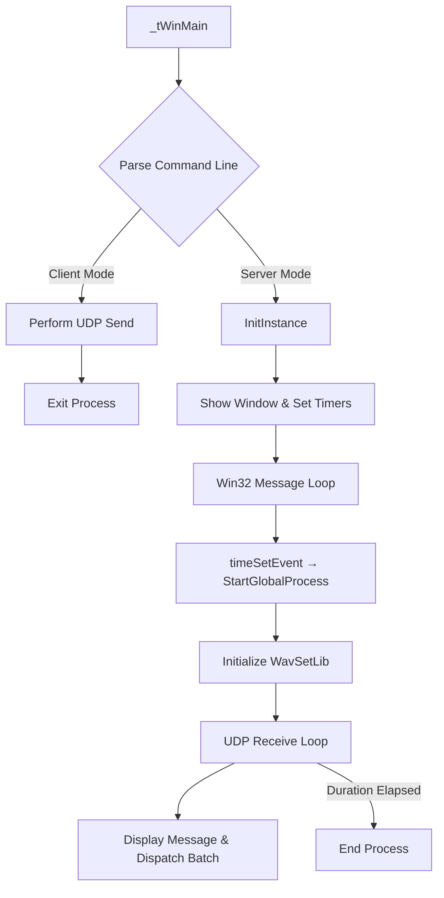

## Internals (for Advanced Users) – Main Execution Flow

This section dives into the low-level control flow of spisocketswin32, tracing how the application initializes, parses its command line, enters server or client mode, and ultimately dispatches its UDP processing loop via a multimedia timer callback.

---

### 1. Entry Point: `_tWinMain`

```cpp
int APIENTRY _tWinMain(
    HINSTANCE hInstance,
    HINSTANCE hPrevInstance,
    LPTSTR    lpCmdLine,
    int       nCmdShow
)
```

- Records the application start timestamp (`global_startstamp_ms = GetTickCount()`).
- Parses ANSI and Unicode command lines:
- `CommandLineToArgvA(GetCommandLineA(), &nArgs)`
- `CommandLineToArgvW(GetCommandLineW(), &nArgsW)`
- Populates globals:
- `global_servername` (“server” or “client”)
- `global_ipaddress` (destination for client)
- `global_message` (payload to send or expected reply)
- Optional window geometry and transparency parameters.
- Short-circuit for **client mode**:
- If `global_servername == "client"`, the application performs a one-shot UDP send of `global_message` to `global_ipaddress` on port 50001 and then exits immediately.
- Otherwise, continues into GUI initialization by calling `InitInstance`.

---

### 2. GUI Initialization: `InitInstance` & `WndProc`

1. **Register and create the main window**
2. Calls `MyRegisterClass(hInstance)` to register the window class.
3. Invokes `CreateWindowEx` with `WS_EX_LAYERED` for per-pixel alpha support.
4. Stores the HWND in `global_hwnd`.
5. Applies layered transparency via `SetLayeredWindowAttributes`.

1. **Display and message loop setup**
2. `ShowWindow(hWnd, nCmdShow)` and `UpdateWindow(hWnd)`.
3. Installs a 5-second Win32 timer (`SetTimer`) for UI updates (unused for UDP, but reserved).
4. Schedules the multimedia timer (`timeSetEvent`) to fire once after 500 ms:

```cpp
     global_timer = timeSetEvent(
         500, 25,
         (LPTIMECALLBACK)&StartGlobalProcess,
         0,
         TIME_ONESHOT
     );
```

- Returns TRUE to enter the standard Win32 message loop.

1. **Window Procedure: **`**WndProc(HWND, UINT, WPARAM, LPARAM)**`
2. Handles:
3. `WM_CREATE` for initial controls (e.g., a static text).
4. `WM_PAINT` to draw the current message buffer.
5. `WM_TIMER` (IDT_TIMER1) for any periodic UI refresh.
6. `WM_DESTROY` to call `PostQuitMessage`.

---

### 3. Entering the UDP Loop: `StartGlobalProcess`

```cpp
void CALLBACK StartGlobalProcess(
    UINT uTimerID,
    UINT uMsg,
    DWORD dwUser,
    DWORD dw1,
    DWORD dw2
)
```

- Initializes the rendering library:

```cpp
  WavSetLib_Initialize(
      global_hwnd, IDC_MAIN_STATIC,
      global_staticwidth, global_staticheight,
      global_fontwidth, global_fontheight,
      global_staticalignment
  );
```

- Enters a blocking loop conditioned on `global_duration_sec`:
- Sleeps for 100 ms.
- Performs a blocking UDP receive on port 50001:
- If in **server mode**, waits indefinitely (or until `global_duration_sec` elapses) for an incoming packet.
- Parses the received byte stream into a UTF-8 string.
- Updates the layered window’s static control with the incoming text.
- Optionally spawns an external batch script (`xaos_cmd_*.bat`) based on parsed commands.
- Repeats until the elapsed time exceeds `global_duration_sec` (if ≥ 0).

---

### 4. Control-Flow Diagram



---

### 5. Key Code References

- **Command-Line Parsing**

Located at the top of `_tWinMain`, using `CommandLineToArgvA` and `CommandLineToArgvW`.

- **Client-Short-Circuit**

Immediately after parsing: branch on `global_servername == "client"`.

- **GUI Setup**

In `InitInstance`: `CreateWindowEx`, `SetLayeredWindowAttributes`, `ShowWindow`, `SetTimer`, `timeSetEvent`.

- **Message Pump**

Standard `while (GetMessage)` loop invoking `DispatchMessage` → `WndProc`.

- **Multimedia Timer**

One-shot timer via `timeSetEvent(500,25,StartGlobalProcess,…)` to kick off the UDP loop.

- **UDP Processing Loop**

In `StartGlobalProcess`: Sleep-receive-render cycle until timeout.

---

### 6. Runtime Behavior Notes

- **Latency**: The 500 ms initial delay before the first UDP receive allows the GUI to fully initialize.
- **Transparency**: Layered window attributes ensure received text overlays transparently atop other applications.
- **Extensibility**: The parsing hook inside `StartGlobalProcess` can launch external scripts (`xaos_cmd_*.bat`) to automate downstream workflows.

This flow ensures a responsive GUI startup while offloading the continuous, blocking UDP listening to a dedicated timer callback, cleanly separating initialization, UI event handling, and network I/O.