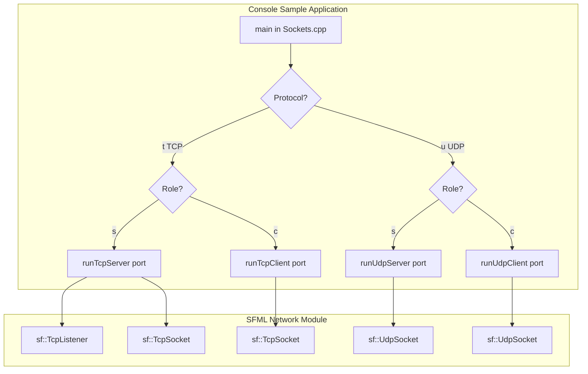

# Networking Details & Protocol Notes (User-Facing) – TCP/UDP Console Samples

## Overview

The repository includes three standalone console applications demonstrating basic network communication using SFML Network on Windows. These examples let developers experiment with both TCP and UDP sockets on port 50001:

- **Sockets.cpp** prompts the user to choose TCP or UDP and client or server mode, then invokes the appropriate sample.
- **TCP.cpp** shows how to build a simple TCP listener (server) and connector (client) that exchange greeting messages.
- **UDP.cpp** illustrates unconnected UDP communication: a server binds to a port and replies to incoming datagrams, and a client sends a datagram then waits for a reply.

These console samples are completely independent of the main GUI application (`spisocketswin32`). They compile into small test programs—useful for debugging networking issues or understanding SFML’s socket API. To include them in the GUI project, add the `.cpp` files to your Visual Studio solution and link against SFML Network and System libraries.

## Architecture Overview

## Component Structure

### 1. Entry Point: Sockets.cpp

*File: `Sockets.cpp`*

**Purpose:**

Presents a simple console menu to select protocol (TCP/UDP) and role (server/client), then dispatches to the corresponding sample routine.

**Key Functions:**

| Function | Description |
| --- | --- |
| `runTcpServer` | Starts the TCP server sample on the default port (50001). |
| `runTcpClient` | Starts the TCP client sample, prompting for the server address. |
| `runUdpServer` | Starts the UDP server sample on port 50001. |
| `runUdpClient` | Starts the UDP client sample, prompting for the server address. |

### 2. TCP Sample: TCP.cpp

*File: `TCP.cpp`*

**Purpose:**

Demonstrates a connection-oriented interaction where a server accepts one client, sends a greeting, then waits for a reply; the client connects, reads the greeting, and sends its own greeting back.

#### runTcpServer(port)

1. Create `sf::TcpListener` and call `listen(port)`.
2. Block on `accept(socket)` to wait for a client.
3. On connect, output the client IP.
4. Send the message `"Hi, I'm the server"` via `socket.send`.
5. Receive up to 128 bytes with `socket.receive` and display the response.

#### runTcpClient(port)

1. Prompt the user for the server address until a valid `sf::IpAddress` is entered.
2. Create `sf::TcpSocket` and call `connect(server, port)`.
3. Receive a message (up to 128 bytes) from the server via `socket.receive`.
4. Send the message `"Hi, I'm a client"` via `socket.send`.

### 3. UDP Sample: UDP.cpp

*File: `UDP.cpp`*

**Purpose:**

Shows unconnected UDP datagram exchange: the server binds and replies to each received datagram, and the client sends one datagram then listens for a response.

#### runUdpServer(port)

1. Create `sf::UdpSocket` and call `bind(port)`.
2. Block on `receive(in, sizeof(in), received, sender, senderPort)`.
3. Display the sender’s IP and message.
4. Reply with `"Hi, I'm the server"` using `socket.send(out, sizeof(out), sender, senderPort)`.

#### runUdpClient(port)

1. Prompt the user for the server address until a valid `sf::IpAddress` is entered.
2. Create `sf::UdpSocket`.
3. Send `"Hi, I'm a client"` via `socket.send(out, sizeof(out), server, port)`.
4. Block on `receive(in, sizeof(in), received, sender, senderPort)` to get the server’s reply, then display it.

## Usage Notes

- **Default Port:** All samples use port 50001 (hard-coded in `Sockets.cpp`).
- **Buffer Size:** Messages are limited to 128 bytes (defined in each sample).
- **Build Requirements:** Link against `sfml-network.lib` and `sfml-system.lib`. The sample `.cpp` files assume SFML headers and libs are in your include/library paths.
- **Integration:** These files are not included in the main GUI project by default. To compile them, add `Sockets.cpp`, `TCP.cpp`, and `UDP.cpp` to a Win32 console project in Visual Studio 2017 and update linker settings.

## Protocol Behavior

- **TCP**
- Connection-oriented: ensures reliable, ordered delivery.
- `sf::TcpListener` handles incoming connection requests.
- `sf::TcpSocket` encapsulates the connected endpoint.
- Blocking calls on `accept`, `receive`, and `send`.
- **UDP**
- Connectionless: may drop or reorder packets.
- `sf::UdpSocket::bind` attaches the socket to the port.
- `send` and `receive` include sender/receiver address and port.
- No explicit connection step.

## Key Functions Reference

| Function | File | Responsibility |
| --- | --- | --- |
| `main` | Sockets.cpp | Prompt for protocol and role, dispatch to sample routines. |
| `runTcpServer` | TCP.cpp | Host a one-shot TCP server: accept, send greeting, receive. |
| `runTcpClient` | TCP.cpp | TCP client: connect, receive greeting, send reply. |
| `runUdpServer` | UDP.cpp | UDP server: bind, receive datagram, send reply. |
| `runUdpClient` | UDP.cpp | UDP client: send datagram, receive reply. |

---

*These console samples provide a quick way to validate networking configuration and learn SFML’s socket API before integrating similar logic into the main GUI application.*