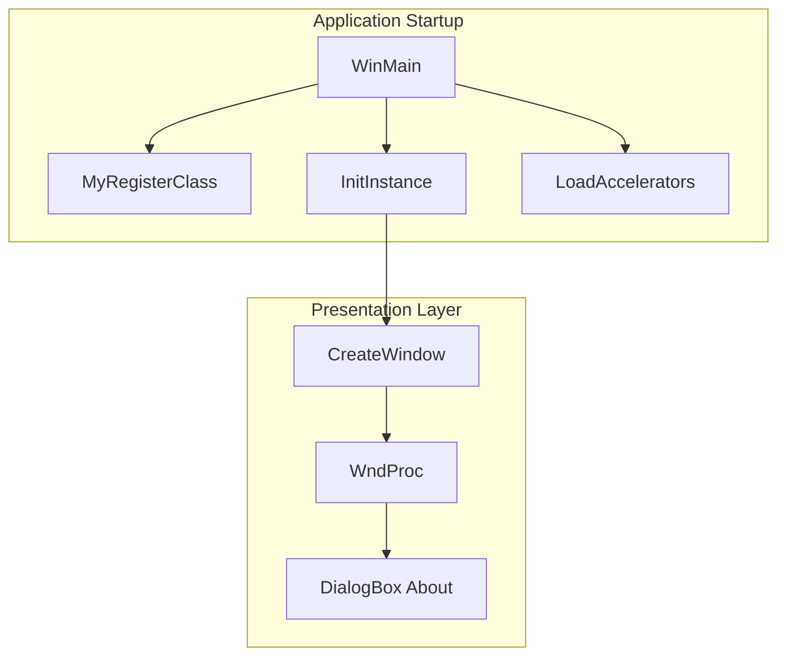
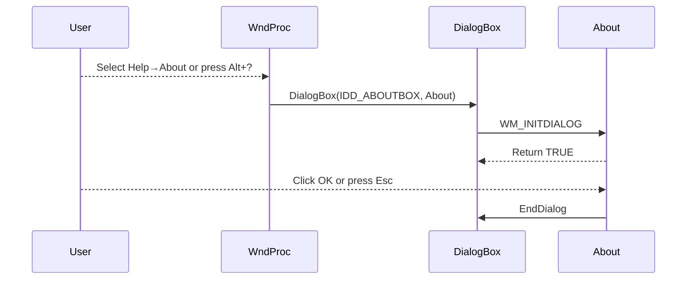

# User Interface & Window Behavior – Menus, About Dialog, and Keyboard Accelerators Feature Documentation

## Overview

This feature provides a conventional Windows menu bar (File → Exit, Help → About), an About dialog box, and optional keyboard accelerators (Alt+?/Alt+/) to invoke the About dialog.  Both the menu bar and accelerators are enabled or disabled at runtime via the global command-line flags `global_menubardisplay` and `global_acceleratoractive`.  When enabled, the menu bar appears in the window’s title bar, and keystrokes trigger the same commands as clicking menu items.  Selecting “Exit” closes the application, while “About” displays a modal dialog with version and copyright information.

## Architecture Overview



## Component Structure

### Presentation Layer

#### **WinMain** (`spisocketswin32.cpp`)

- Purpose:
- Entry point of the application
- Parses `global_menubardisplay` and `global_acceleratoractive` flags
- Loads accelerators table if enabled
- Runs the main message loop
- Key Behavior:
- 

```cpp
  if (global_acceleratoractive) {
      hAccelTable = LoadAccelerators(hInstance, MAKEINTRESOURCE(IDC_SPIWAVWIN32));
  } else {
      hAccelTable = NULL;
  }
```

#### **MyRegisterClass** (`spisocketswin32.cpp`)

- Purpose:
- Registers the window class and associates the menu resource when `global_menubardisplay` is true
- Key Behavior:

```cpp
  if (global_menubardisplay) {
      wcex.lpszMenuName = MAKEINTRESOURCE(IDC_SPIWAVWIN32);
  } else {
      wcex.lpszMenuName = NULL;
  }
```

#### **InitInstance** (`spisocketswin32.cpp`)

- Purpose:
- Creates the main application window using the window class registered by `MyRegisterClass`
- Applies layered transparency settings
- Shows and updates the window
- Note: Menu presence is determined by the class’s `lpszMenuName`, set in `MyRegisterClass` .

#### **WndProc** (`spisocketswin32.cpp`)

- Purpose:
- Central message handler for the main window
- Processes `WM_COMMAND` for menu selections
- Menu Command Handling:

| Command ID | Action |
| --- | --- |
| `IDM_ABOUT` | `DialogBox(hInst, MAKEINTRESOURCE(IDD_ABOUTBOX), hWnd, About);` |
| `IDM_EXIT` | `DestroyWindow(hWnd);` |


#### **About Dialog Callback** (`spisocketswin32.cpp`)

- Purpose:
- Implements the modal About dialog box behavior
- Key Behavior:

```cpp
  case WM_INITDIALOG:
      return (INT_PTR)TRUE;
  case WM_COMMAND:
      if (LOWORD(wParam) == IDOK || LOWORD(wParam) == IDCANCEL) {
          EndDialog(hDlg, LOWORD(wParam));
          return (INT_PTR)TRUE;
      }
      break;
```

### Resources

#### **Resource Script** (`spisocketswin32.rc`)

- Menu Definition for `IDC_SPIWAVWIN32`:

```rc
  IDC_SPIWAVWIN32 MENU
  BEGIN
      POPUP "&File"
      BEGIN
          MENUITEM "E&xit",   IDM_EXIT
      END
      POPUP "&Help"
      BEGIN
          MENUITEM "&About .", IDM_ABOUT
      END
  END
```

- Accelerator Table for `IDC_SPIWAVWIN32`:

```rc
  IDC_SPIWAVWIN32 ACCELERATORS
  BEGIN
      "?", IDM_ABOUT, ASCII, ALT
      "/", IDM_ABOUT, ASCII, ALT
  END
```

#### **Resource IDs** (`Resource.h`)

| Identifier | Value | Description |
| --- | --- | --- |
| `IDM_ABOUT` | 104 | About menu command |
| `IDM_EXIT` | 105 | Exit menu command |
| `IDC_SPIWAVWIN32` | 109 | Menu and accelerator ID |
| `IDD_ABOUTBOX` | 103 | About dialog resource |
| `IDC_STATIC` | –1 | Static control placeholder |


### Conditional Features

- **Menu Bar Display**

Controlled by the integer flag `global_menubardisplay` (0 = off, 1 = on).  When on, the class registration associates the `IDC_SPIWAVWIN32` menu resource with the window .

- **Keyboard Accelerators**

Controlled by `global_acceleratoractive` (0 = off, 1 = on).  When on, WinMain loads the `IDC_SPIWAVWIN32` accelerator table so that Alt+? and Alt+/ trigger the About command .

## Feature Flows

### 1. Application Launch with Menu & Accelerators

```mermaid
sequenceDiagram
    participant WM as WinMain
    participant MR as MyRegisterClass
    participant IN as InitInstance
    participant ML as LoadAccelerators
    participant Loop as MessageLoop

    WM->>MR: RegisterClassEx with menu if enabled
    WM->>IN: CreateWindow
    WM->>ML: LoadAccelerators if global accelerator active
    WM->>Loop: Enter message loop
```

### 2. User Invokes About



## Key Classes Reference

| Function (Conceptual Class) | File | Responsibility |
| --- | --- | --- |
| WinMain | spisocketswin32.cpp | Application entry; flag parsing; accelerator loading; loop |
| MyRegisterClass | spisocketswin32.cpp | Window class registration; conditional menu association |
| InitInstance | spisocketswin32.cpp | Creates and shows the main window with layered transparency |
| WndProc | spisocketswin32.cpp | Main message handler; processes menu commands |
| About | spisocketswin32.cpp | Modal About dialog procedure |


---