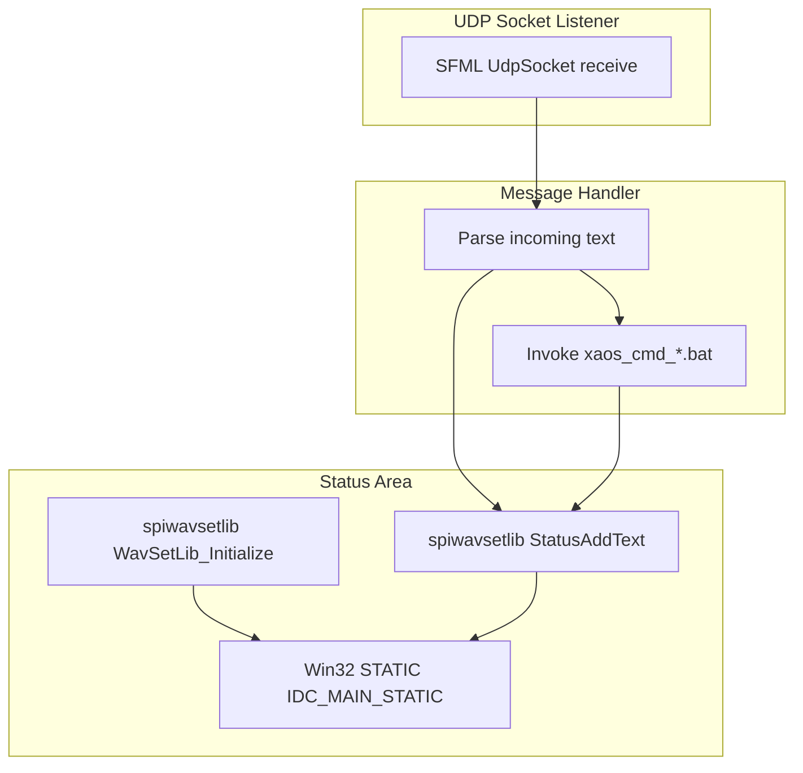

# User Interface & Window Behavior - Status Text Rendering (spiwavsetlib Integration)

## Overview

The status text rendering feature provides a transparent, layered text area that displays incoming UDP messages and log output in real time. Leveraging the spiwavsetlib library, it initializes and controls a Win32 STATIC control (IDC_MAIN_STATIC) to render text with configurable font size, alignment, and wrapping. When the window is resized or the message‐processing loop starts, the library is reinitialized to fit the new dimensions, ensuring consistent appearance.

Beyond displaying raw messages, the incremental logging API (`StatusAddText`) appends new lines as data arrives, preserving history and allowing automation scripts (xaos*.bat) to be triggered based on parsed commands. This visual feedback is crucial for debugging, monitoring, and user confirmation of remote-control actions.

## Architecture Overview



## Component Structure

### 1. Presentation Layer

#### Static Control Creation

**File:** spisocketswin32.cpp (WndProc handler for WM_CREATE)

- Purpose: Create a transparent STATIC control to host status text.
- Key Steps:
- `CreateWindowEx` with `WS_EX_TRANSPARENT`, `WS_CHILD | WS_VISIBLE | global_staticalignment`.
- Assign control ID `IDC_MAIN_STATIC`.
- Apply font via `SendMessage(..., WM_SETFONT, global_hFont, ...)`.

```cpp
case WM_CREATE:
{
    HWND hStatic = CreateWindowEx(
        WS_EX_TRANSPARENT,
        L"STATIC", L"",
        WS_CHILD | WS_VISIBLE | global_staticalignment,
        0, 100, 100, 100,
        hWnd, (HMENU)IDC_MAIN_STATIC,
        GetModuleHandle(NULL), NULL
    );
    SendMessage(hStatic, WM_SETFONT, (WPARAM)global_hFont, MAKELPARAM(FALSE, 0));
}
break;
```

#### Window Resize Behavior

**File:** spisocketswin32.cpp (WndProc handler for WM_SIZE)

- Purpose: Reinitialize text layout and resize the static control on window size changes.
- Actions:
- Retrieve client rect via `GetClientRect`.
- Update `global_staticwidth` and `global_staticheight`.
- Call `WavSetLib_Initialize` with updated dimensions.
- Move and resize the static control via `SetWindowPos`.

```cpp
case WM_SIZE:
{
    RECT rc;
    GetClientRect(hWnd, &rc);
    global_staticwidth  = rc.right;
    global_staticheight = rc.bottom;
    WavSetLib_Initialize(
        global_hwnd, IDC_MAIN_STATIC,
        global_staticwidth, global_staticheight,
        global_fontwidth, global_fontheight,
        global_staticalignment
    );
    SetWindowPos(
        GetDlgItem(hWnd, IDC_MAIN_STATIC),
        NULL, 0, 0,
        global_staticwidth, global_staticheight,
        SWP_NOZORDER
    );
}
break;
```

### 2. spiwavsetlib Integration

#### WavSetLib_Initialize

- Location: Called in `StartGlobalProcess` and `WM_SIZE`.
- Purpose: Prepare the STATIC control for text rendering—sets buffer size, font metrics, alignment.
- Parameters:
- `HWND` of main window (`global_hwnd`)
- Control ID (`IDC_MAIN_STATIC`)
- Width & height in pixels (`global_staticwidth`, `global_staticheight`)
- Font cell width & height (`global_fontwidth`, `global_fontheight`)
- Text alignment flags (`global_staticalignment`)

#### StatusAddText

- Location: Within the UDP receive loop in `spisocketswin32.cpp`.
- Purpose: Append a null-terminated string to the control’s text buffer, handling line breaks and scrolling.
- Usage Patterns:
- Log loop iteration boundaries (`StatusAddText("\n")`).
- Display incoming message lines (`StatusAddText(global_line.c_str())`).
- Warn on invalid commands (`StatusAddText("WARNING: invalid xaos command received\n")`).

```cpp
// Example log append in receive loop
StatusAddText(global_line.c_str());
StatusAddText("\n");
```

### 3. Message Logging Flow

```mermaid
sequenceDiagram
    participant Udp as SFML UdpSocket
    participant Loop as ReceiveLoop
    participant Status as spiwavsetlib StatusAddText
    participant Cmd as ShellExecuteA

    Udp->>Loop: receive in sender port
    Loop->>Status: StatusAddText newline
    Loop->>Status: StatusAddText global_line
    Loop->>Cmd: ShellExecuteA xaos_cmd bat
    loop per message
        Status->>Status: update buffer and render
    end
```

## Dependencies

- **spiwavsetlib**: Provides `WavSetLib_Initialize` and `StatusAddText` for text rendering.
- Win32 API: STATIC control, window messages (WM_CREATE, WM_SIZE).
- Global configuration variables:
- `global_fontheight` (configurable via CLI)
- `global_fontwidth`
- `global_staticalignment`

## Key Functions Reference

| Function | Responsibility |
| --- | --- |
| StartGlobalProcess | Initialize text area on timer start; enters sleep/loop for duration control |
| WndProc (WM_CREATE) | Create and configure the STATIC control for status text |
| WndProc (WM_SIZE) | Reinitialize spiwavsetlib and resize/move the STATIC control on window resize |
| Receive Loop | Parse incoming UDP messages, log via `StatusAddText`, dispatch xaos*.bat |
